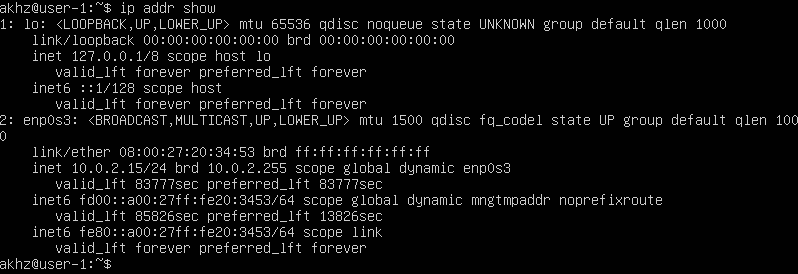
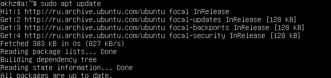
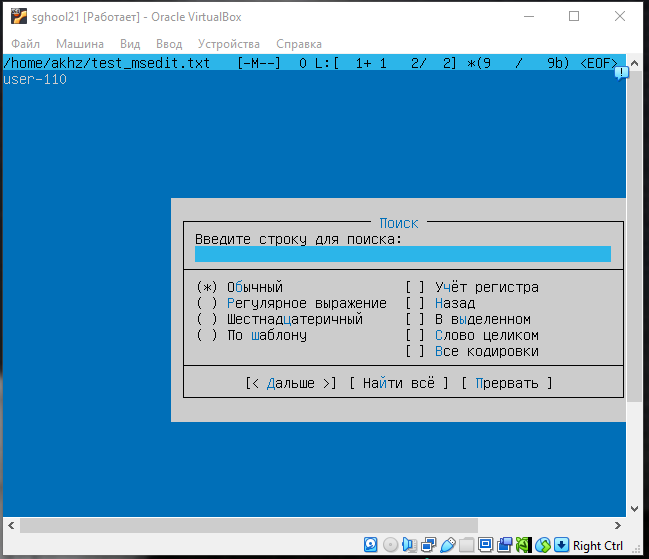
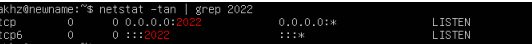
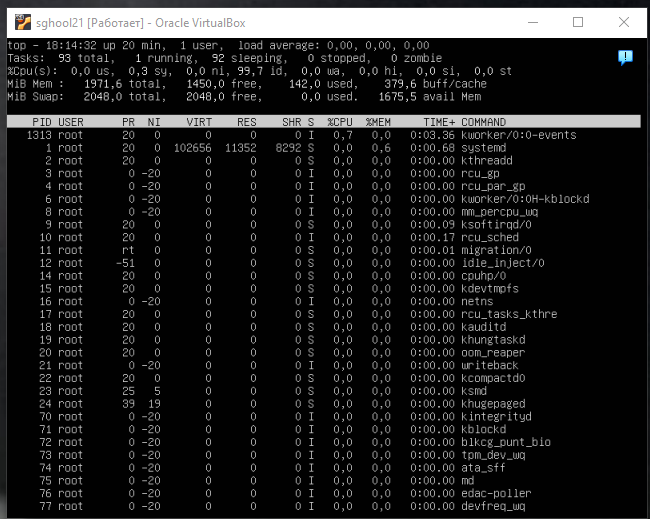
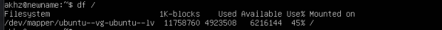

## Task 1 (Установка вируталки / образ системы / проверка версии)

**Задача:**

> Проверьте версию Ubuntu, выполнив команду `cat /etc/issue`

1. **Скачиваем вирутал бокс:**
2. **Скачиваем образ линукс:**


3. **Создание виртуальной машины:**


4. **Установка пользователя:**


5. **Выделение памяти и процессоров под машину:**


6. **Виртуальный жесткий диск под систему:**


7. **Ввести версию ядра:**


---

## Task 2 (Создание пользователя / проверка его существования в рядах adm)

**1. Команда `sudo useradd -m user21`**:


**2. Проверяем что пользователь создался - `cat /ets/passwd:`**


---

## Task 3 (Работа с сетью и настройка IP)

1. **Установка имени хоста машины.**

   `sudo vim /etc/hostname` - прописываю user-1 и сохраняю.

> **Hostname** - файл который содержит индификатор компьютера в сети (как локальной так и глобальной), аналог  IP.

2. **Изменение часового пояса так как у пензы нет своего региона как я не пытался его изменить поставлена была Москва.**
   

> `sudo timedate set-timezone Europe/Moscow` - меняю часовой пояс

3. **Выведите имена сетевых интерфейсов с помощью консольной команды.**


> *lo* (loopback device) – виртуальный интерфейс, присутствующий по умолчанию в любом Linux. Он используется для отладки сетевых программ и запуска серверных приложений на локальной машине. С этим интерфейсом всегда связан адрес  *127.0.0.1* . У него есть dns-имя –  *localhost* .
>
> dns - это система доменных имен, которая преобразует удобные для человека адреса (например, `example.com`) в IP-адреса, которые необходимы для связи между устройствами.

4. **Используйте консольную команду, чтобы получить IP-адрес устройства, с которым вы работаете, от DHCP-сервера. Расшифруйте DHCP в отчете.**
   

> `ip addr show` -  показывает айпи адреса как внури устройства так и с DHCP.
>
> Вданном случае это  `inet 10.0.2.15/24 brd 10.0.2.255 scope global dynamic enp0s3.`
> `10.0.2.15` - это  **IP-адрес** , который был назначен устройству.
> `/24`  - маска подсети,
>
> DHCP расшифровывается как **Dynamic Host Configuration Protocol** (Протокол динамической конфигурации хоста). Это протокол, который позволяет устройствам в сети автоматически получать IP-адреса и другие сетевые параметры, такие как маска подсети и шлюз по умолчанию, от сервера DHCP.

5. **Определите и отобразите внешний IP-адрес шлюза (ip) и внутренний IP-адрес шлюза, также известный как IP-адрес по умолчанию (gw).**

   `ip route | grep default -  узнать внутренний айпи адрес`

   

> **via 10.0.2.2** — это IP-адрес шлюза (маршрутизатора) в локальной сети.
> **dev enp0s3** — это интерфейс, через который осуществляется подключение
> **proto dhcp** — указывает, что IP-адрес был назначен через DHCP.
> **metric 100** — это метрика маршрута (используется для определения предпочтительности маршрута).

` curl ifconfig.me`


> **37.113.18.44** — это внешний IP-адрес шлюза) через которыйустройство подключается к интернету. Этот адрес видим для всех.

6. **Установите статические (заданные вручную, а не полученные от DHCP-сервера) настройки IP, GW, DNS (используйте публичные DNS-серверы, например, 1.1.1.1 или 8.8.8.8). Перезагрузите виртуальную машину. Убедитесь, что статические сетевые настройки (ip, gw, dns) соответствуют заданным в предыдущем пункте.**

1.1 `sudo vim /etc/netplan/00-installer-config.yaml`

1.2

```**bash
network:
  ethernets:
    enp0s3:                 # Имя интерфейса 
      dhcp4: false             # Отключить DHCP
      addresses: [10.0.2.15/24]  # статический IP-адрес
      gateway4: 10.0.2.2     # IP-адрес шлюза (внутренний IP)
      nameservers:
        addresses: [8.8.8.8, 1.1.1.1]         # DNS Cloudflare
version: 2

```


1.3 `sudo netplan apply - обновление настроек `

1.4 `sudo reboot - перезагрузка системы `

1.5 `ip a` - проверка статического адреса

1.6 `ip route | grep default` - проверка шлюза

1.7 `ping -c 4 1.1.1.1   `


---

## Task 4 (Oбновление системных пакетов)

1. **Обновите системные пакеты до последней версии.**

   

---

## Task 5 (Использование команды `sudo`)

1. **Что такое sudo:**

> Команда `sudo` позволяет пользователю временно выполнять команды с правами администратора (root) без необходимости входить в систему как root. 
> Это помогает:
>
>     Работать безопаснее, так как пользователи используют повышенные привилегии только при необходимости.
>
>     Вести учёт всех действий, выполняемых с помощью`sudo`, что делает процесс прозрачным и упрощает контроль.

2. `sudo usermod -aG sudo user-1` и `groups user-1`


3. `su - user-1`


`sudo vim /etc/hostname && sudo reboot `


---

## Task 6 ( Установка и настройка службы времени)

·1. **Выведите время часового пояса, в котором вы в данный момент находитесь:**


·2. **Вывод следующей команды должен содержать NTPSynchronized=yes:**


---

## Task 7 (Установка и работа с текстовыми редакторами)

1. **Установите текстовый редактор ****VIM**** (+ любые два других, если вам нравятся ****NANO**** , **MCEDIT**).**

   Вим утановлен по дефолту как  и нано, установил mcedit.

   ```bash
   sudo apt install mc
   ```


`shift+z+z`


`cntrl +x +y`


`f2 + f10`

2. **Используя каждый из трех выбранных редакторов, откройте файл для редактирования, отредактируйте файл, заменив псевдоним на строку «21 School 21», закройте файл, не сохраняя изменения.**


`esc + :q!`


`cntrl + x + n`


`f10 + n`

3. **Используя каждый из трех выбранных редакторов, отредактируйте файл еще раз (аналогично предыдущему пункту), а затем освойте функции поиска по содержимому файла (слову) и замены слова на любое другое.**


`cnrtl + w `


`cntrl + \`



`f7`


`f4`

---

## Task 8 (Установка и базовая настройка сервиса **SSHD**)

1. **Установите службу SSHd.**


2. **Добавить автоматический запуск службы при каждой загрузке системы.**

   
3. **Сбросьте службу SSHd на порт 2022 и проверьте в фоновом режиме.**


`sudo systemctl restart ssh`


`ps aux | grep sshd`

* **`ps`** — показывает список активных процессов.
* **`aux`** :
* **a** — вывод процессов всех пользователей.
* **u** — отображает информацию о пользователе, запустившем процесс.
* **x** — включает процессы, которые не привязаны к терминалу.
* **`| grep sshd`** — фильтрует вывод команды, показывая только строки, содержащие `sshd`.

4. ·***Вывод команды netstat -tan должен содержать
   tcp 0 0.0.0.0:2022 0.0.0.0:* LISTEN
   (если команды netstat нет, ее необходимо установить);**

`sudo apt install net-tools `



* **`-t`** : Показывает только TCP-соединения.
* **`-a`** : Показывает все соединения, включая те, которые только слушают.
* **`-n`** : Выводит все адреса и порты в числовом формате, избегая попыток разрешить имена.
* **`tcp`** — тип протокола (TCP).
* **`0`** — количество байт, ожидающих отправки.
* **`0.0.0.0`** — означает, что служба принимает соединения на всех интерфейсах.  Часто используется для  **открытых серверов** , которые должны быть доступны для внешних подключений.
* **`:2022`** — порт, на котором слушает SSHd.
* **`*`** — любые удаленные адреса могут подключиться.
* **`LISTEN`** — порт открыт для входящих подключений.

---

## Task 9 (Установка и использование утилит `top` , `htop`)

1. **Установите и запустите утилиты top и htop.**

##### Top

`sudo apt install htop`



* **время безотказной работы - `18:14:32 up 20 min`**
* **количество авторизованных пользователей - `1`**
* **средняя загрузка системы - `load average: 0.00, 0.00, 0.00`**
* **общее количество процессов - `93`**
* **загрузка процессора - `%Cpu(s): 0.0 us, 0.3 sy, 0.0 ni, 99.7 id, 0.0 wa, 0.0 hi, 0.0 si, 0.0 st`**
* **загрузка памяти - `MiB Mem :  1971.6 total,  1450.0 free,  142.0 used,  379.6 buff/cache`**
* **pid процесса с наибольшим использованием памяти - `1`**
* **pid процесса, потребляющего больше всего процессорного времени `1313 `**

---

##### Htop

2. **Cортировка по PID, PERCENT_CPU, PERCENT_MEM, TIME** `shift + f6`


3. **Oтфильтровано для процесса sshd:**
   `f4`


4. **C процессом syslog, найденным путем поиска:**
   `f3`


5. **C добавленным выводом имени хоста, часов и времени безотказной работы** :


---

## Task 10 (Использование утилиты `fdisk`)

1. **Запустите команду fdisk -l.**

```
sudo fdisk -l
```


* **название жесткого диска** - `/dev/sda`
* **его емкость** - `25 Gib`
* **количество секторов** - `52428800`
* **размер раздела подкачки** - `23Gib`

---

## Task 11 (Использование утилиты `df`)

1. **Выполните команду `df`.**

   

* **размер раздела** -  `1178760`
* **используемое пространство** - `4923508`
* **cвободное пространство** - `6216144`
* **процент использованного** - `45%`

**Определите и запишите в отчете единицу измерения.** - `килобайты`

2. **Выполните команду `df -Th`.**

   

* **размер раздела** - `12 G`
* **используемое пространство** - `4.7 G`
* **свободное пространство** - `6.0 G`
* **процент использованного** - `45% `

**Определите и запишите в отчет тип файловой системы раздела.** - `ext4`

---

## Task 12 (Использование утилиты `du`)

**1. Вывести размер папок /home, /var, /var/log (в байтах, в удобном для чтения формате)**


**2. Вывести размер всего содержимого в /var/log (не общий размер, а каждый вложенный элемент, используя )**


---

## Task  13 (Установка и использование утилиты `ncdu`)

1. **Установите утилиту ncdu**


2. **Вывести размер папок /home, /var, /var/log.**

**

---

## Task 14 (**Работа с системными журналами**)

1. **Запишите в отчет время последнего успешного входа в систему, имя пользователя и способ входа.**

   `sudo grep --color=auto "login" /var/log/auth.log 
   `


**Последний вход 22 декабря 20:37, метод входа login, юзером akhz.**

2. **Перезапустите службу SSHd.**

   `sudo systemctl restart sshd`
3. **Добавьте в отчет снимок экрана сообщения о перезапуске службы (поищите его в журналах).**

   

---

## Task 15 (CRON)

·1. **Найдите строки в системных журналах (не менее двух в указанном диапазоне времени) о выполнении;**


2. **Отображение списка текущих заданий для CRON;**


3. **Удалите все задачи из планировщика заданий.**


·
